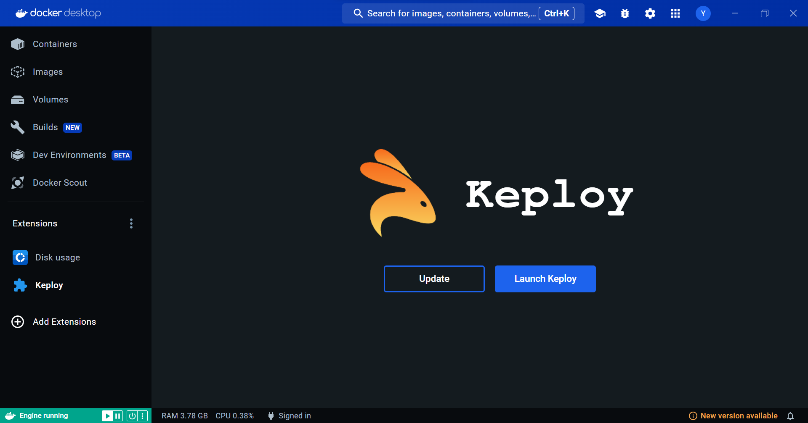
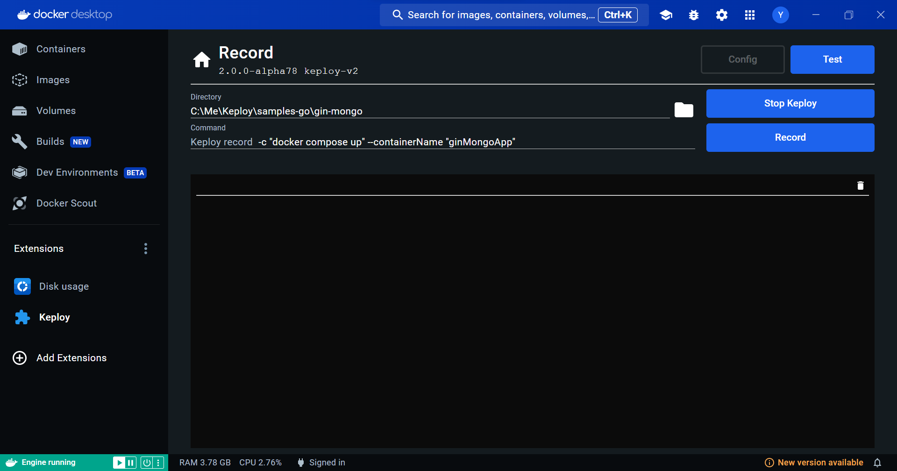
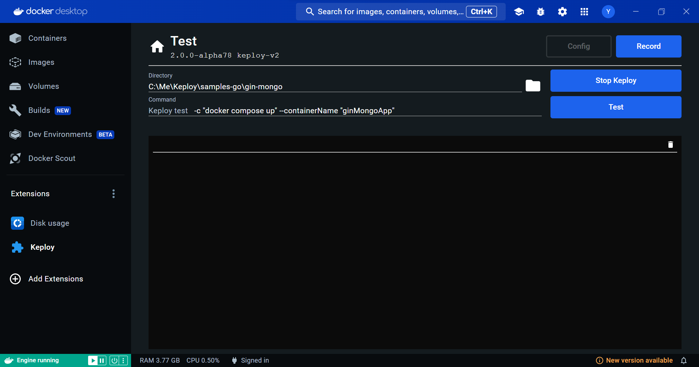

# Keploy Docker Extension

Keploy is developer-centric API testing tool that creates backend tests along with built-in-mocks, faster than unit tests. 

Note: This repo is supposed to be a prototype for Keploy Docker extenstion.

You can try it out [here](https://open.docker.com/extensions/marketplace?extensionId=yaxhveer/keploy).

## Features

### Install / Update Keploy

### Record Test Cases

### Replay Test Cases

## Upcoming Feature

- Allow Configuration file input.
- Better terminal.  